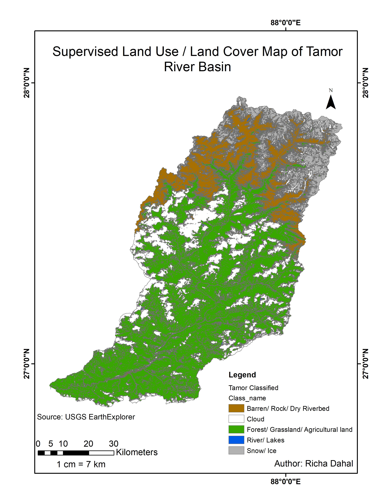

# Supervised Land Use / Land Cover Classification

## Study Area
Tamor River Basin

## Objective
To classify land use and land cover using supervised classification.

## Software Used
- ArcMap 10.7

## Data Source
- USGS EarthExplorer

## Methodology
- Training sample selection
- Supervised classification (Maximum Likelihood)
- Post-processing

## Classes
- Barren / Rock / Dry Riverbed
- Forest / Grassland / Agricultural land
- River / Lakes
- Snow / Ice
- Cloud

## Output

## Author
Richa Dahal
