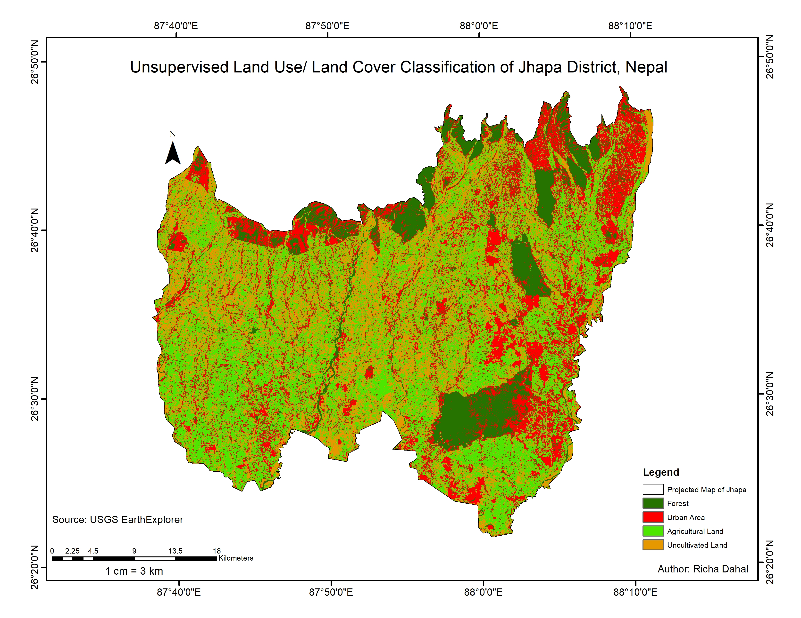
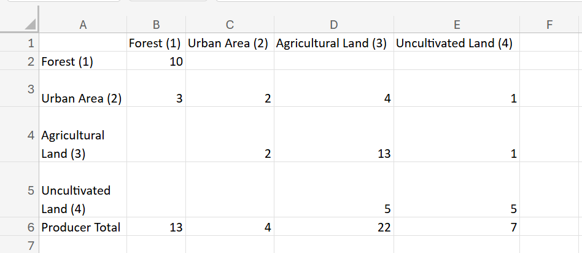

## Unsupervised Land Use / Land Cover Classification

### Study Area
Tamor River Basin

### Objective
To classify land use and land cover using unsupervised classification techniques.

### Software Used
- ArcMap 10.7

### Data Source
- USGS EarthExplorer

### Methodology
- Image preprocessing
- Unsupervised classification (e.g., ISODATA / K-means)
- Class interpretation and labeling

### Output

## Accuracy Assessment

An accuracy assessment was performed to evaluate classification performance.

### Methods
- Confusion matrix was generated
- Ground truth/reference data was used for validation
- 

### Metrics
- Overall Accuracy: 65.217%
- Producer’s Accuracy: 64.36%
- User’s Accuracy: 62.81%
- Kappa Coefficient: 51.70%

### Notes
The results indicate the reliability of the classification, with some misclassification observed between similar land cover classes.

### Author
Richa Dahal
