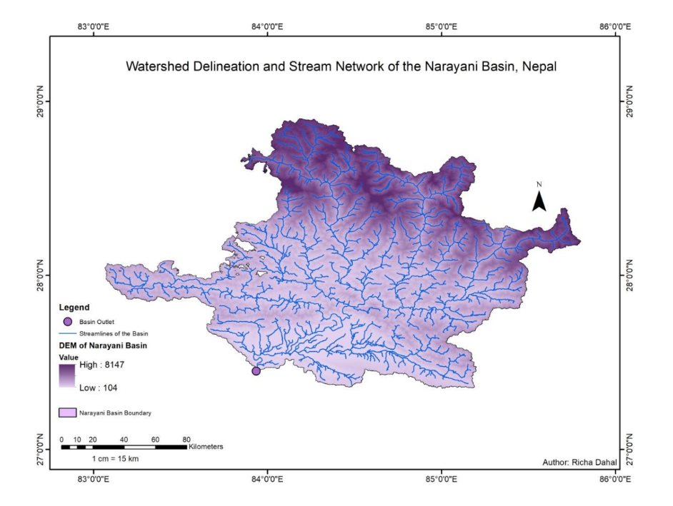

## Watershed Delineation – Narayani River Basin

### Objective
To delineate watershed boundaries and extract stream networks using DEM data.

### Software Used
- ArcMap 10.7

### Data Source
- Digital Elevation Model (DEM)

### Methodology

1. Sink Filling:
   Removed depressions in DEM to ensure continuous flow

2. Flow Direction:
   Determined direction of water flow for each cell

3. Flow Accumulation:
   Calculated accumulation of flow to identify streams

4. Stream Definition:
   Applied threshold to extract stream network

5. Watershed Delineation:
   Defined watershed boundary based on outlet point

### Outputs
- Watershed boundary map
- Stream network map

### Output

### Author
Richa Dahal
